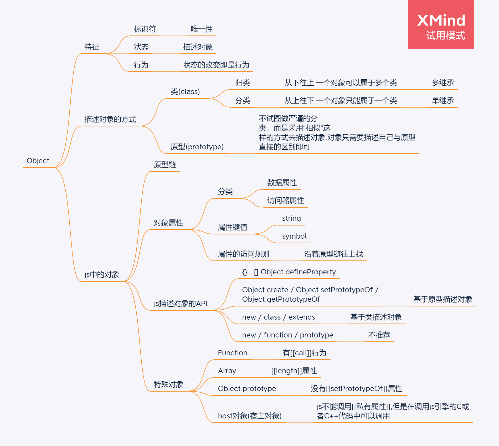

学习笔记

## 语言通识


## Number

#### 什么是浮点数?

**定点数**: 一种实数数据类型,要求小数点后位数固定,有时也要求小数点前位数固定.

**浮点数**: 与定点数相反,小数点后的位数是不固定的.是一种对于实数的近似值数值表现法,由一个有效数字(尾数)a加上幂数e来表示,通常是乘以某个基数b的整数次指数e得到.计算机中通常基数b=2.
$$
a = m * b^e
$$

例如: 十进制数字1, 可以表示为 $1 * 10 ^ 0$,也可以表示为$ 0.1*10^1$,这里对十进制数1的不同表示,是通过改变指数e来完成的,这就是浮点数**浮点**的意义


**单精度浮点数**:在计算机存储器中占4个字节(32bit)的浮点数

**双精度浮点数**:在计算机存储器中占8个字节(64bit)的浮点数

**浮点数精度损失**

浮点数相比于定点数，在同样bit数下面表示了更大的范围，但是损失了精度，且有个特点，浮点数的精度随着绝对值的增大而大幅度降低。

**浮点数计算的精度损失**:由于日常生活习惯十进制,但是计算机底层是用二级制浮点数表示数据及进行数据计算,所以通常是计算机将十进制转换为二级制浮点数,然后再进行计算,而在十进制转换为二进制浮点数的时候就会出现精度损失.这时就会出现类似$0.1 + 0.2 \neq 0.3$的情况.

##### 浮点数规格化

**二进制浮点数规格化**:将二进制浮点数转换为整数位为1的形式.例:  $1.01 * 2^2 $

**其他进制浮点数规格化**:将浮点数转换为整数位为0,小数位第一位为非0的形式.例:$0.35 *10^-3$

##### 移码

浮点数计算时,需要通过小数点的移动使指数相同,然后进行计算.

## String

string是有字符构成的,字符在不同的字符集有着不同的码点(code point).

常见字符集: ASCII码,GBK,ISO-8859,BIG5,Unicode,UCS

js使用的是Unicode字符集的UTF-16编码方式

UTF-8与UTF-16对应的码点是相同的,只是两者的编码方式不同

```javascript
//写一段 JS 的函数，把一个 string 它代表的字节给它转换出来，用 UTF8 对 string 进行遍码。
function UTF8_Encode(str){
    if(!str) return
    let utf8Buffer = new Uint8Array()
    for(let c of str){
        utf8Buffer = new Uint8Array([...utf8Buffer, ...getCharacterUTF8BinaryStr(c).split('')])
    }
    return utf8Buffer
}

function UTF8ByteNum(c) {
    const charBinaryLen =  c.codePointAt().toString(2).length
    if(charBinaryLen <= 7){
        return 1
    }else if(charBinaryLen <= 11){
        return 2
    }else if(charBinaryLen <= 16){
        return 3
    }else if(charBinaryLen <= 21){
        return 4
    }else if(charBinaryLen <= 26){
        return 5
    }else if(charBinaryLen <= 31){
        return 6
    }
}

function getCharacterUTF8BinaryStr(c) {
    const codePointBinaryStr = c.codePointAt().toString(2)
    const codePointBinaryStrLen =  codePointBinaryStr.length
    const byteNum = UTF8ByteNum(c)
    let utf8binaryStr = null
    if(byteNum === 1){
        utf8binaryStr = '0'.repeat(8 - codePointBinaryStrLen) + codePointBinaryStr
    }else{
        // 按照utf8编码规则,拼接字符串: 字节数个1 + 0 + 第一个字节剩余的0 + 出现在第一个字节上的码点 + 出现在其他字节上的码点,并且其他字节上都以10开头
        utf8binaryStr = '1'.repeat(byteNum) + '0' + '0'.repeat(8 - (byteNum + 1) - (codePointBinaryStrLen - (byteNum - 1) * 6)) 
        + codePointBinaryStr.substring(0, codePointBinaryStrLen - (byteNum - 1) * 6) 
        + codePointBinaryStr.substring(codePointBinaryStrLen - (byteNum - 1) * 6, codePointBinaryStrLen).split('').reduce((acc, curr) => {
            // 填满一个字节
            if(acc.length % 8 === 0){
                return acc + '10' + curr
            }else{
                return acc + curr
            }
        }, '10')
    }
    return utf8binaryStr
}
```

## Object




#### 参考:

[图形编程中常用浮点数及其精度详解](https://gameinstitute.qq.com/community/detail/128514)

[浮点数的阶码，尾数与移码](https://blog.csdn.net/qq_28215385/article/details/78315945)

[UTF-8维基百科](https://zh.wikipedia.org/wiki/UTF-8)

[UTF-16维基百科](https://zh.wikipedia.org/wiki/UTF-16)